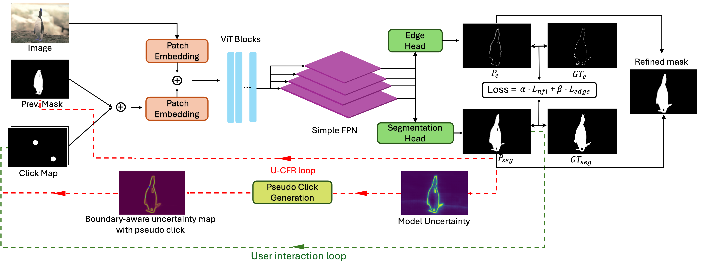
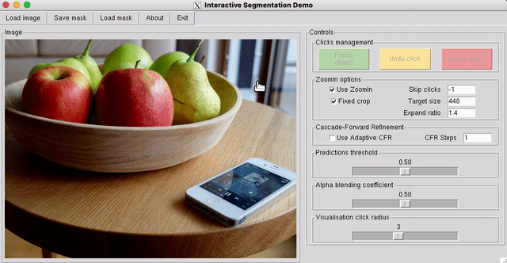

## [U-CFR: Uncertainty-Guided Cascade Forward Refinement for Interactive Segmentation]()

<p align="center">
  
</p>


## Environment
Training and evaluation environment: Python 3.9, PyTorch 1.13.1, CUDA 11.0. Run the following command to install required packages.
```
pip3 install -r requirements.txt
```

You need to configue the paths to the datasets in `config.yml` before training or testing. 

## Dataset

A script `download_datasets.sh` is prepared to download and organize required datasets.

| Dataset   |                      Description             |           Download Link              |
|-----------|----------------------------------------------|:------------------------------------:|
|SBD        |  8498 images with 20172 instances for (train)<br>2857 images with 6671 instances for (test) |[official site][SBD]|
|Grab Cut   |  50 images with one object each (test)       |  [GrabCut.zip (11 MB)][GrabCut]      |
|Berkeley   |  96 images with 100 instances (test)         |  [Berkeley.zip (7 MB)][Berkeley]     |
|DAVIS      |  345 images with one object each (test)      |  [DAVIS.zip (43 MB)][DAVIS]          |
|Pascal VOC |  1449 images with 3417 instances (test)      |  [official site][PascalVOC]          |
|COCO_MVal  |  800 images with 800 instances (test)        |  [COCO_MVal.zip (127 MB)][COCO_MVal] |

[MSCOCO]: https://cocodataset.org/#download
[LVIS]: https://www.lvisdataset.org/dataset
[SBD]: http://home.bharathh.info/pubs/codes/SBD/download.html
[GrabCut]: https://github.com/saic-vul/fbrs_interactive_segmentation/releases/download/v1.0/GrabCut.zip
[Berkeley]: https://github.com/saic-vul/fbrs_interactive_segmentation/releases/download/v1.0/Berkeley.zip
[DAVIS]: https://github.com/saic-vul/fbrs_interactive_segmentation/releases/download/v1.0/DAVIS.zip
[PascalVOC]: http://host.robots.ox.ac.uk/pascal/VOC/
[COCOLVIS_annotation]: https://github.com/saic-vul/ritm_interactive_segmentation/releases/download/v1.0/cocolvis_annotation.tar.gz
[COCO_MVal]: https://github.com/saic-vul/fbrs_interactive_segmentation/releases/download/v1.0/COCO_MVal.zip

## Demo
<p align="center">
  
</p>

An example script to run the demo. 
```
python demo.py --checkpoint=weights/sbd_vit_base_ufcr.pth --gpu 0
```

## Evaluation

Before evaluation, please download the datasets and models, and then configure the path in `config.yml`.

Download our model trained model:


Use the following code to evaluate the huge model.

```
python scripts/evaluate_model.py NoBRS \
    --gpu=0 \
    --checkpoint=sbd_vit_base_ufcr.pth \
    --datasets=GrabCut,Berkeley,DAVIS,BraTS,OAIZIB,ssTEM,COCO_MVal,PascalVOC,SBD \
    --cf-n=1 \
    --cf-click 

# cf-n: CFR steps
# cf-click: whether to do ucfr clicks
```

## Training

Before training, please download the [MAE](https://github.com/facebookresearch/mae) pretrained weights (click to download: [ViT-Base](https://dl.fbaipublicfiles.com/mae/pretrain/mae_pretrain_vit_base.pth), [ViT-Large](https://dl.fbaipublicfiles.com/mae/pretrain/mae_pretrain_vit_large.pth), [ViT-Huge](https://dl.fbaipublicfiles.com/mae/pretrain/mae_pretrain_vit_huge.pth)) and configure the dowloaded path in `config.yml`

Please also download the pretrained SimpleClick models from [here](https://github.com/uncbiag/SimpleClick).

Use the following code to train a base model on SBD: 
```
python train.py models/plainvit_base448_sbd.py \
    --batch-size=140 \
    --ngpus=4
```

## Citation

```

```

## Acknowledgement
Our project is developed based on [SimpleClick](https://github.com/uncbiag/SimpleClick) and [ICL-CFR](https://github.com/TitorX/CFR-ICL-Interactive-Segmentation)
